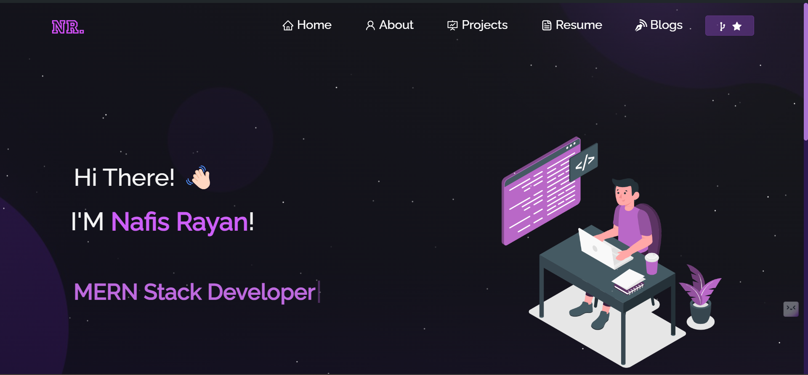
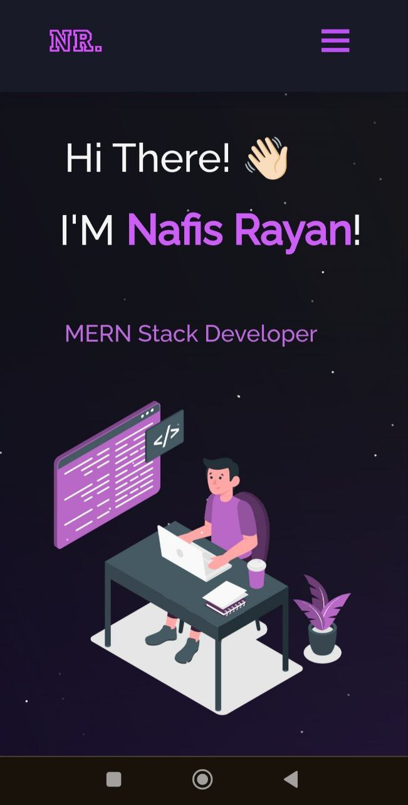

<h2 align="center">
Portfolio Website
  <!-- Visit the live site: [nafisrayan.tech](https://nafisrayan.tech) -->
</h2>
This repository contains the source code for my personal portfolio website. It showcases my projects, skills, and experiences in a clean and interactive manner.
 

  
  

 

## Built With

This project was built using these technologies.

- React.js
- Node.js
- Express.js
- CSS3
- VsCode
- Vercel

## Features

**📖 Multi-Page Layout**

**🎨 Styled with React-Bootstrap and Css with easy to customize colors**

**📱 Fully Responsive**

## Attributes

- **Responsive Design**: The website is designed to be responsive, ensuring it looks great on all devices.
- **Navigation Bar**: A sticky navigation bar for easy site navigation.
- **Projects Section**: Displays a list of my projects with links to live demos and source codes.
- **About Me**: A section dedicated to providing more details about myself and my professional background.
- **Resume**: An embedded resume showcasing my educational qualifications and work experience.
- **Contact Information**: Easy-to-find contact information for reaching out.

## Getting Started

Clone down this repository. You will need `node.js` and `git` installed globally on your machine.

## 🛠 Installation and Setup Instructions

1. Installation: `npm install`

2. In the project directory, you can run: `npm start`

Runs the app in the development mode.\
Open [http://localhost:3000](http://localhost:3000) to view it in the browser.
The page will reload if you make edits.

## Usage Instructions

Open the project folder and Navigate to `/src/components/`.  
You will find all the components used and you can edit your information accordingly.
